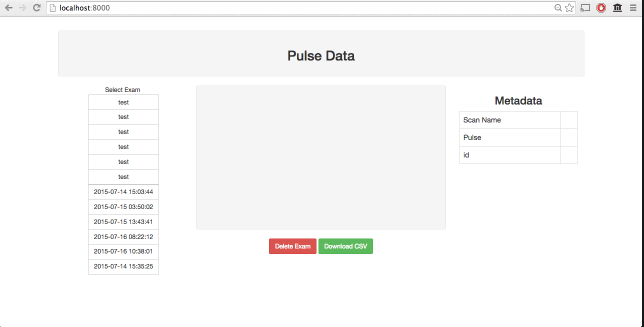

#CloudPulse
My cloud connected pulse plethysmograph project. My goals with this project were to design and develop a straightforward "connected" medical device from the ground up. This is a super fun project that involves analog electronics, firmware, frontend, backend, and even 3D printing work (with much still ongoing).
More coming soon! 

