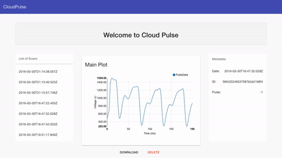

#CloudPulse
My cloud connected pulse plethysmograph project. My goals with this project were to design and develop a straightforward "connected" medical device from the ground up. This continues to be a super fun project involving analog electronics, firmware, frontend, backend, and even 3D printing work (much still is ongoing).


http://pulse.suyash.io

## Setup
To install this web application on a vanilla debian-flavored linux server:
  1. Install git: ```sudo apt-get install git```
  2. Clone & run Suyash's provision script: 
  
  ```bash
  git clone https://github.com/suyashkumar/provision.git
  cd provision
  ./provision.sh
  ```

## Run the Application
After provisioning a server as noted above:
  1. Clone this repository: `git clone https://github.com/suyashkumar/CloudPulse.git`
  2. Travel to the logging folder: `cd CloudPulse/app`
  3. Install dependencies: `npm install`
  4. Set the port to run on: `export PORT=80`
  5. Run using authbind if running on a privliged port: `authbind node server.js`


